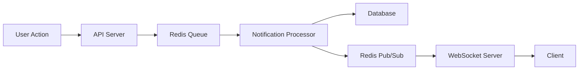
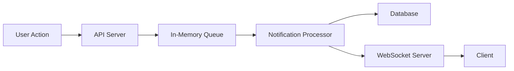

# Redis in Insyd Notification System

## Overview

The Insyd notification system uses Redis as its primary message broker and queue system, with an in-memory fallback mechanism. This document explains the architecture, benefits, and fallback strategy.

## Why Redis?

### 1. Persistence

- Redis provides data persistence, ensuring notifications aren't lost if the server restarts
- In-memory queue loses all data on server restart
- Critical for production environments where data loss is unacceptable

### 2. Scalability

- Redis can handle high throughput of notifications
- Supports multiple consumers processing notifications simultaneously
- Can be scaled horizontally with Redis Cluster
- In-memory queue is limited to a single server's memory

### 3. Pub/Sub Capabilities

- Redis Pub/Sub enables real-time notification delivery
- Efficient broadcasting of notifications to multiple subscribers
- Lower latency compared to polling mechanisms
- Built-in support for pattern matching in channels

### 4. Atomic Operations

- Redis provides atomic operations for queue management
- Ensures no duplicate notifications or lost messages
- Prevents race conditions in high-concurrency scenarios

## Architecture

### Primary Flow (Redis Active)



### Fallback Flow (Redis Down)



## Implementation Details

### 1. Queue System

```typescript
// Primary Redis Queue
await redis.lPush("notifications", JSON.stringify(notification));

// Fallback In-Memory Queue
class InMemoryQueue {
  private queue: any[] = [];
  async lPush(key: string, value: string) {
    this.queue.unshift(JSON.parse(value));
  }
}
```

### 2. Real-time Delivery

```typescript
// Redis Pub/Sub
await redis.publish("notification-events", eventData);

// Fallback Direct WebSocket
websocket.send(JSON.stringify(notification));
```

## Why Both Redis and In-Memory?

### 1. High Availability

- Redis provides robust, persistent storage
- In-memory queue ensures system continues working if Redis fails
- Zero downtime during Redis maintenance or issues

### 2. Development Flexibility

- In-memory queue simplifies local development
- No Redis required for basic testing
- Easier to debug and test notification flow

### 3. Cost Optimization

- Redis requires additional infrastructure
- In-memory queue sufficient for small deployments
- Can start with in-memory and scale to Redis as needed

## Performance Comparison

### Redis

- ✅ Persistent storage
- ✅ Scalable across multiple servers
- ✅ Built-in pub/sub capabilities
- ✅ Atomic operations
- ❌ Additional infrastructure required
- ❌ Network latency for operations

### In-Memory

- ✅ Zero latency (in-memory operations)
- ✅ No additional infrastructure
- ✅ Simple implementation
- ❌ Data lost on server restart
- ❌ Limited to single server
- ❌ No built-in pub/sub

## Best Practices

### 1. Error Handling

```typescript
try {
  await redis.lPush("notifications", JSON.stringify(notification));
} catch (error) {
  console.warn("Redis failed, using in-memory queue:", error);
  inMemoryQueue.lPush("notifications", JSON.stringify(notification));
}
```

### 2. Health Checks

- Regular monitoring of Redis connection
- Automatic failover to in-memory queue
- Alert system for Redis issues

### 3. Data Consistency

- Regular synchronization between Redis and database
- Validation of notification delivery
- Retry mechanisms for failed operations

## Scaling Considerations

### Small Scale (100 DAUs)

- In-memory queue sufficient
- Single Redis instance optional
- Basic monitoring

### Medium Scale (10,000 DAUs)

- Redis required
- Redis Cluster for high availability
- Enhanced monitoring

### Large Scale (1M+ DAUs)

- Redis Cluster with sharding
- Multiple notification processors
- Advanced monitoring and alerting
- Load balancing

## Conclusion

The dual-queue system (Redis + In-memory) provides:

1. High availability through redundancy
2. Flexibility in deployment options
3. Scalability for growing user base
4. Zero-downtime maintenance capability
5. Cost-effective development and testing

This architecture ensures the notification system remains operational regardless of Redis availability while maintaining the benefits of Redis for production environments.
